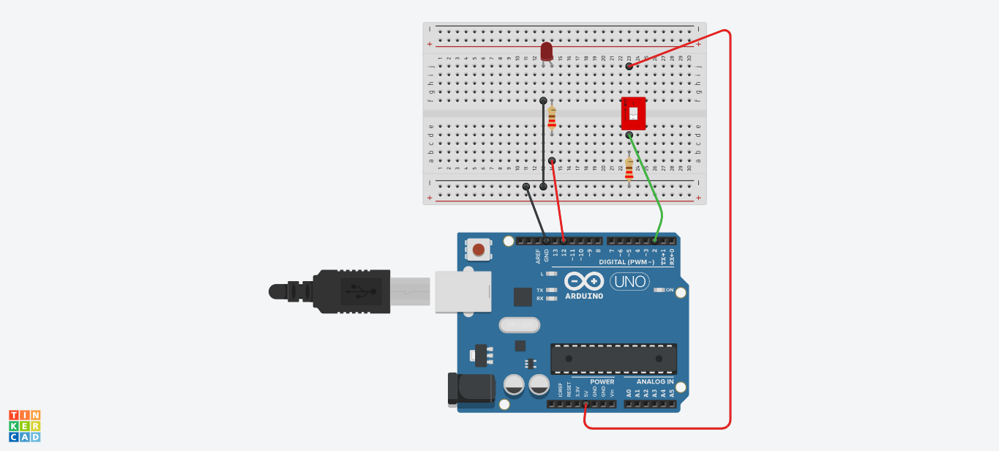

# :rocket: Day 03: I'm worried about your battery levels

## Add a DIP Switch


### Complete an LED circuit with a DIP Switch
**Key Learning Points:**

- Used a DIP (Dual In-line Package) Switch to control an OUTPUT.
- Learned that a resistor (_220Ohm_) is necessary to set voltage as HIGH or LOW when using a switch.
  > NOTE: If we try to connect 5V to the HERO INPUT (0V) with just a switch, it will cause a short circuit. When the switch is in the closed position, the INPUT pin is connected by wires to both 5V and 0V at the same time. Connecting 5V to 0V directly without a resistor will release too much current in the circuit and the correct INPUT will not be determined. Using a resistor to connect a switch to GND while the switch is open means that because there is no current flowing, a voltage difference on either side of the resistor doesn't exist. Therefore the INPUT will read as 0V and keep the LED OUTPUT as LOW. When the switch is closed, the INPUT will see 5V and the current will flow through the resistor to GND, completing the circuit.
- Used the negative (-) strip on the breadboard to connect both circuits to GND (0V).
- Used the pinMode() function to set a pin as INPUT.
```C++
int Switch1 = 2; //pin 2 will be attached to our switch

void setup() {
  // setup both an output AND an input on the HERO
  pinMode(Switch1, INPUT);

}
```
- Used the digitalRead() function to determine the state of the INPUT pin.
- Wrote a conditional test to operate instructions based on the outcome of the test.

```C++
void loop() {
  //now within loop() we'll take actions based on the status of the input switch
  //this is a conditional test...
  if (digitalRead(Switch1) == HIGH){
    digitalWrite(LED, HIGH); // turn LED ON
  }
  else {
    digitalWrite(LED, LOW); //turn LED OFF
  }
}
```

#

### Diagram


