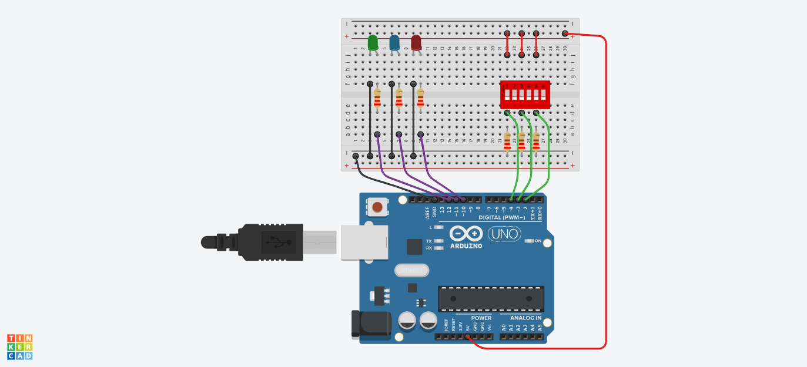

# :rocket: Day 04: Cabin Lighting

## Add more LEDs and inputs


### Use DIP Switch as 3 INPUTS to control 3 OUTPUTS
**Key Learning Points:**

- Defined 6 integer variables; used to identify which pins would be used in the circuit.
- Used the pinMode() function to set the pins as INPUT or OUTPUT
- Used a conditional test within the loop() function based on the 3 INPUTS to turn the 3 LEDs o ON or OFF

```C++
void loop() {
 //now within loop() we'll take actions based on the status of the switches
  if (digitalRead(Switch1) == HIGH){     //check switch #1
  digitalWrite(LED1, HIGH); // turn LED ON  
 }
 else {
  digitalWrite(LED1, LOW); // turn LED OFF
 }
```

#

### Diagram


