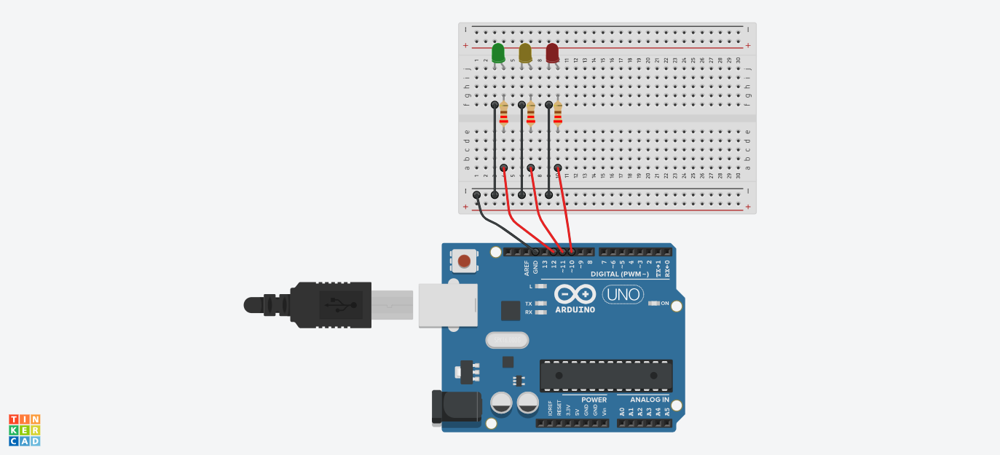

# :rocket: Day 05: Creative Day #1

## Test your knowledge


### Create a simple traffic light
**Key Learning Points:**
- Aligned LED's in a taffic light succession (Green, Yellow, Red)
- Coded pins 10-12 as OUTPUTs
- Used the loop() function to iterate through a series of commands to turn each LED on or off after specified intervals
  > NOTE: How could a DIP Switch be incorporated to the circuit?

```C++
void loop() {
  // put your main code here, to run repeatedly:
  digitalWrite(green, HIGH);
  digitalWrite(red, LOW); //turns red off when code loops back
  delay(5000);
   
  digitalWrite(green, LOW);
  digitalWrite(yellow, HIGH);
  delay(3000);

  // turn off yellow, then turn red on for 5 seconds
  digitalWrite(yellow, LOW);
  digitalWrite(red, HIGH);
  delay(5000);

}
```

#

### Diagram


