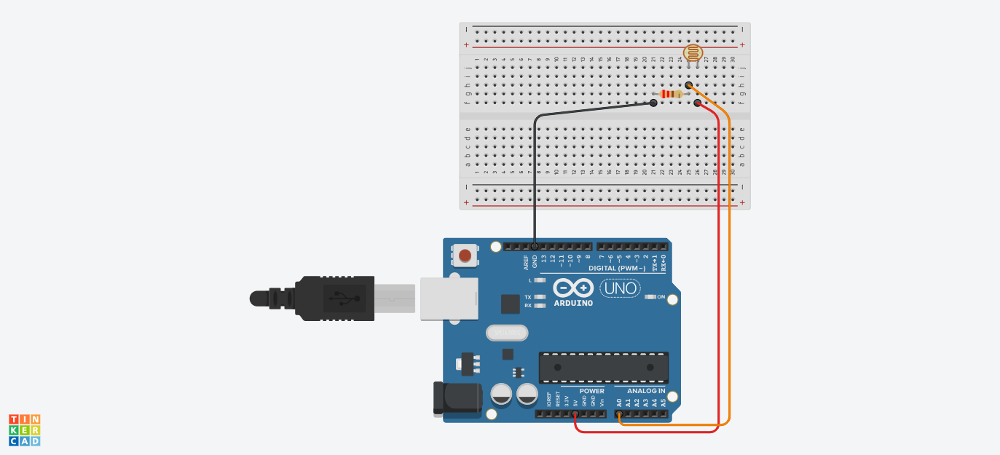

# :rocket: Day 06: Time to fix the battery

## Serial monitor window, photoresistors and input analog pins


### Read analog pin connected to a photoresistor and write out its value to the serial monitor
**Key Learning Points:**
- declared 3 integer variables to show that we would be using the A0 pin, the onboard LED and a variable to contain the value of the light levels.

```C++
int sensorPin = A0;   // select the *analog zero* input pin for probing the photoresistor
int onboardLED = 13;  // select the pin for the HERO's built-in LED
int sensorValue = 0;  // variable that we'll use to store the value reading from the sensor
```
 
- The **Serial Monitor Window** is used to communicate directly with the HERO board. The Serial communication line is opened by a command: Serial.begin(9600); within the setup() function. The 9600 represents the speed of communication in bits per second.
  > NOTE: In order to view the serial monitor window click the icon on the top right-hand side of the screen in the Arduino IDE.
- Opened the serial communication line and determined the speed of this communication. Used the pinMode() command to set the onboard LED as an output.
- Use Serial.printIn("Example text"); to print to the serial monitor.
  > NOTE: Serial.print("Example text"); may also be used, however, printIn moves the cursor down a line acting like a carriage return.

```C++
void setup() {
  // put your setup code here, to run once:
 Serial.begin(9600);
 pinMode(onboardLED, OUTPUT);
 
}
```

- Pins A0-A5 are analog INPUT pins. Analog INPUT varies voltage INPUT between the values of 0 and 1024, compared to digital pins that can only identify 0V or 5V (HIGH or LOW).
- A photoresistor or Light Dependent Resistor (LDR) has a resistance that depends on the amount of light that falls on it. It has a very HIGH resistance when it is in the dark and a LOW resistance when it is in bright light. The voltage drop across the photoresistor varies as the light level changes.
- Made the sensorValue variable within the loop() function equal to the value on the A0 input pin, and made the onboard LED flash on and off. Made the length of the flash equal to the value of sensorValue. This value was also printed to the serial monitor.
- Shining light to the photoresistor makes the reading HIGH and darkness prints the reading as LOW.

```C++
void loop() {
   // Pulse the builtin LED for a time determined by the sensor
  sensorValue = analogRead(sensorPin);
  digitalWrite(onboardLED, HIGH);
  delay(sensorValue);
  digitalWrite(onboardLED, LOW);
  delay(sensorValue);

   // Read the analog sensor value and send it to serial
  Serial.println(sensorValue);
  delay(sensorValue);
 
}
```

#

### Diagram


